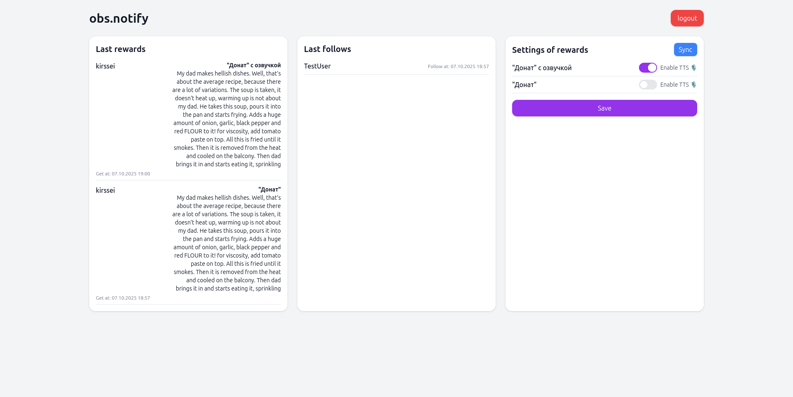

# 🎮 obs.notify

A self-hosted Django-based app that connects to Twitch API and displays **follows** and **rewards** in real time.  
Perfect for streamers who want to manage notifications locally or integrate them with OBS via WebSocket.



## 🧱 Tech Stack
🐍 Python 3.12  
🎯 Django  
⚡ Django Channels  
💬 gTTS  
🔗 twitchAPI  
📦 Poetry

## 🚀 Features

- 🟣 OAuth2 Twitch authentication  
- 🔔 Real-time follow and reward tracking  
- 💬 Text-to-Speech (TTS) using Google TTS  
- ⚡ WebSocket broadcasting for OBS or other clients  
- 🗃️ Local database storage (SQLite or your choice)  
- 🧩 Modular Django app structure for easy scaling  
  
## 🛠️ Requirements

- Python **3.10+**  
- [Poetry](https://python-poetry.org/)  
- Twitch Developer account ([create one here](https://dev.twitch.tv/console))  
- A `.env` file with your credentials (see below)  

---

## ⚙️ Installation (Developer Setup)

Clone the repository and install dependencies:

```bash
git clone https://github.com/kirssei/obs.notify.git
cd obs.notify
python -m venv env
. env/bin/activate
poetry install
```

Create a .env file in the project root from `env_template`:
```bash
SECRET_KEY=your_django_secret_key
DEBUG=True
```

Run database migrations:
```
python manage.py migrate
```

Start the Django development server:
```bash
uvicorn app.asgi:application --reload
```

## 🔐 Environment Variables
| Variable              | Description         | Example                                        |
| --------------------- | ------------------- | ---------------------------------------------- |
| `SECRET_KEY`          | Django secret key   | `your-secret-key`                              |
| `DEBUG`               | Enables debug mode  | `True`                                         |
| `TTS_LANG`            | Language of TTS     | `ru`                                           |


## 🧠 How It Works

1. Go to http://localhost:8000/notify/login  
2. Enter your **Twitch Client ID** and **Client Secret**  
3. You’ll be redirected to Twitch for authorization  
4. After successful login, the app:  
    - Saves your Twitch tokens  
    - Connects to Twitch EventSub  
    - Starts listening for rewards and follows
5. You can view real-time data at /notify/

## 🎥 Connecting to OBS
You can display your Twitch notifications (follows, rewards, TTS messages) directly in OBS using a Browser Source.

Steps:  
- Open **OBS Studio**.
- Click `+` to add a new **Browser Source**.
- In the **Properties** window select **Local File** and choose the HTML file.
- Enable the checkbox **Control Audio via OBS** to allow TTS sounds to play through your stream.
- Click **OK**, and your Twitch notifications will appear in OBS

*Template of this HTML file you can find in repository - `index.html`*

*If you have made changes to the file, then you need to click on **Properties** and on the **Reset page cache** button so that the changes apply to OBS as well.*


## 📜 License

This project is licensed under the BSD 3-Clause License.

## 💖 Credits

Developed with ☕ and 🧠 by kirssei.
